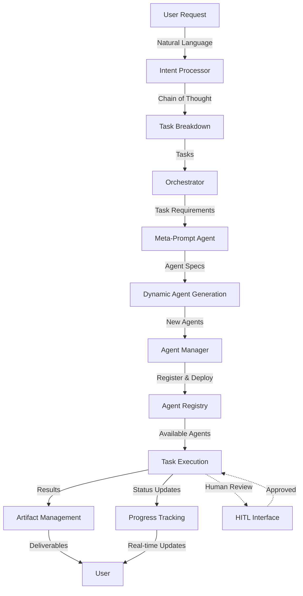

# Universal Orchestration System - Complete Flow

## Overview
The UOS is designed as a multi-agent orchestration platform that takes natural language requests and automatically generates, deploys, and manages specialized AI agents to fulfill those requests.

## End-to-End Flow



## Detailed Component Flow

### 1. 🧠 Intent Processor (Entry Point)
**Current Status: ✅ Implemented with Real LLM + CoT**

When a user makes a request like "Build a real-time chat application":

```python
# User Request
{
  "text": "Build a real-time chat application with user authentication",
  "request_id": "chat-app-123"
}

# Intent Processor analyzes using:
- RobustIntentAnalyzer (multiple strategies)
- MetaPromptAgent (domain detection)
- Chain of Thought streaming (user engagement)

# Output
{
  "intent_type": "feature_request",
  "confidence": 0.85,
  "tasks": [
    {
      "id": "task_1",
      "title": "Design WebSocket Architecture",
      "type": "design",
      "required_capabilities": ["websocket", "real-time", "architecture"],
      "estimated_hours": 8
    },
    {
      "id": "task_2", 
      "title": "Implement Authentication Service",
      "type": "backend",
      "required_capabilities": ["auth", "jwt", "security"],
      "estimated_hours": 12
    },
    {
      "id": "task_3",
      "title": "Build Chat UI Components",
      "type": "frontend",
      "required_capabilities": ["react", "ui", "real-time"],
      "estimated_hours": 16
    }
  ]
}
```

### 2. 🎯 Orchestrator (Workflow Engine)
**Current Status: 🟡 Basic Implementation**

The Orchestrator receives the task breakdown and:

1. **Creates a Temporal Workflow** for the entire project
2. **Analyzes task dependencies** and parallelization opportunities
3. **Checks Agent Registry** for existing capable agents
4. **Requests new agents** if capabilities are missing

```go
// Orchestrator Workflow
func ExecuteProjectWorkflow(ctx workflow.Context, project Project) error {
    // 1. Analyze all tasks
    taskGraph := buildDependencyGraph(project.Tasks)
    
    // 2. For each task, find or create agents
    for _, task := range taskGraph.GetExecutableNTasks() {
        agent := findOrCreateAgent(task.RequiredCapabilities)
        
        // 3. Execute task with agent
        result := executeTaskWithAgent(ctx, task, agent)
        
        // 4. Handle results/artifacts
        storeArtifacts(result)
    }
}
```

### 3. 🤖 Meta-Prompt Agent (Dynamic Agent Generator)
**Current Status: 🔴 Planned**

When the Orchestrator needs an agent with specific capabilities:

```python
# Request to Meta-Prompt Agent
{
  "required_capabilities": ["websocket", "real-time", "architecture"],
  "task_context": "Design WebSocket Architecture for chat app",
  "constraints": {
    "language": "python",
    "framework_preferences": ["fastapi", "socket.io"],
    "security_requirements": ["jwt", "rate-limiting"]
  }
}

# Meta-Prompt Agent generates:
{
  "agent_name": "websocket-architect-agent",
  "system_prompt": "You are an expert WebSocket architect...",
  "capabilities": {
    "design_patterns": ["pub-sub", "rooms", "presence"],
    "technologies": ["socket.io", "redis", "nginx"],
    "outputs": ["architecture diagrams", "technical specs", "code templates"]
  },
  "docker_config": {
    "base_image": "python:3.11",
    "dependencies": ["fastapi", "python-socketio", "redis"],
    "entry_point": "agent_server.py"
  },
  "integration_endpoints": {
    "design": "/api/v1/design-architecture",
    "validate": "/api/v1/validate-design",
    "generate": "/api/v1/generate-template"
  }
}
```

### 4. 📦 Agent Manager (Agent Lifecycle)
**Current Status: ✅ Implemented with Registry**

The Agent Manager:
- **Receives agent specifications** from Meta-Prompt Agent
- **Builds and deploys** agent containers dynamically
- **Registers agents** in the distributed registry
- **Monitors health** and performance
- **Scales agents** based on demand

```typescript
// Agent Registration Flow
class AgentManager {
  async deployDynamicAgent(agentSpec: AgentSpecification) {
    // 1. Generate Dockerfile
    const dockerfile = generateDockerfile(agentSpec);
    
    // 2. Build container
    const imageId = await buildContainer(dockerfile);
    
    // 3. Deploy to orchestration platform
    const deployment = await deployToKubernetes(imageId, agentSpec);
    
    // 4. Register in distributed registry
    await agentRegistry.register({
      id: agentSpec.agent_name,
      capabilities: agentSpec.capabilities,
      endpoint: deployment.endpoint,
      status: 'ready'
    });
    
    // 5. Start health monitoring
    startHealthCheck(agentSpec.agent_name);
  }
}
```

### 5. 🔄 Task Execution Flow
**Current Status: 🟡 Basic Implementation**

Once agents are ready:

```javascript
// Task Execution
async function executeTask(task, agent) {
  // 1. Send task to specialized agent
  const executionRequest = {
    task_id: task.id,
    task_details: task,
    context: getProjectContext(),
    constraints: getConstraints()
  };
  
  // 2. Agent processes task
  const result = await agent.execute(executionRequest);
  
  // 3. Store artifacts
  await artifactManager.store({
    task_id: task.id,
    artifacts: result.artifacts,
    code: result.generated_code,
    documentation: result.docs
  });
  
  // 4. Update progress
  await progressTracker.update(task.id, 'completed');
  
  return result;
}
```

### 6. 🎨 Current Agent Types

#### Static Agents (Pre-built):
- **code-gen-agent**: Generates code based on specifications
- **test-gen-agent**: Creates test suites
- **doc-gen-agent**: Generates documentation
- **review-agent**: Code review and quality checks

#### Dynamic Agents (Meta-Prompt Generated):
- **domain-expert-agent**: Specialized for specific domains
- **integration-agent**: Handles third-party integrations  
- **migration-agent**: Data/code migration specialist
- **performance-agent**: Optimization specialist

### 7. 🔄 Feedback & Learning Loop

```python
# HITL (Human-in-the-Loop)
if task.requires_human_review:
    review_request = createReviewRequest(task, result)
    human_feedback = await getHumanFeedback(review_request)
    
    if human_feedback.approved:
        finalizeTask(task, result)
    else:
        # Re-execute with feedback
        improved_result = await agent.execute_with_feedback(
            task, 
            human_feedback.suggestions
        )

# AITL (AI-in-the-Loop)
if task.requires_ai_review:
    ai_review = await reviewAgent.analyze(result)
    if ai_review.has_issues:
        refined_result = await agent.refine(result, ai_review.suggestions)
```

## 🚀 What Makes Our Design Unique

1. **Dynamic Agent Generation**: We don't just use static agents - we generate specialized agents on-demand based on task requirements

2. **Multi-Strategy Resilience**: Multiple fallback strategies ensure robustness (LLM → Rules → Keywords)

3. **Distributed Architecture**: Agents can scale independently, run on different nodes

4. **Real-time Transparency**: Chain of Thought streaming keeps users engaged

5. **Artifact Management**: All generated code, docs, and assets are tracked and versioned

6. **Cost-Aware**: Built-in cost tracking for LLM usage (pending implementation)

## 🔮 Next Evolution Steps

1. **Complete Meta-Prompt Agent**: Auto-generate specialized agents
2. **Implement Artifact Management**: Store and version all outputs  
3. **Add HITL/AITL Interfaces**: Human and AI review loops
4. **Enable Agent Marketplace**: Share and reuse agents
5. **Implement Cost Controls**: Budget limits and optimization
6. **Add Deployment Pipeline**: Auto-deploy generated applications

## Example: Full Flow in Action

```bash
# User Request
"Create a machine learning pipeline for sentiment analysis with data preprocessing, 
model training, and REST API deployment"

# System Response:
1. Intent Processor → Identifies ML project with 5 tasks
2. Orchestrator → Creates workflow, identifies need for:
   - data-preprocessing-agent (exists)
   - ml-training-agent (needs creation)
   - api-deployment-agent (exists)
3. Meta-Prompt Agent → Generates ml-training-agent with:
   - Expertise in NLP, sentiment analysis
   - Knowledge of scikit-learn, transformers
   - Ability to tune hyperparameters
4. Agent Manager → Deploys new ml-training-agent
5. Execution → Agents work in parallel where possible:
   - Preprocessing agent cleans data
   - ML agent trains models
   - API agent creates endpoints
6. Artifacts → Delivers:
   - Cleaned dataset
   - Trained model files
   - API code with documentation
   - Deployment scripts
   - Performance metrics
```

This is how our platform orchestrates from natural language to delivered solutions!